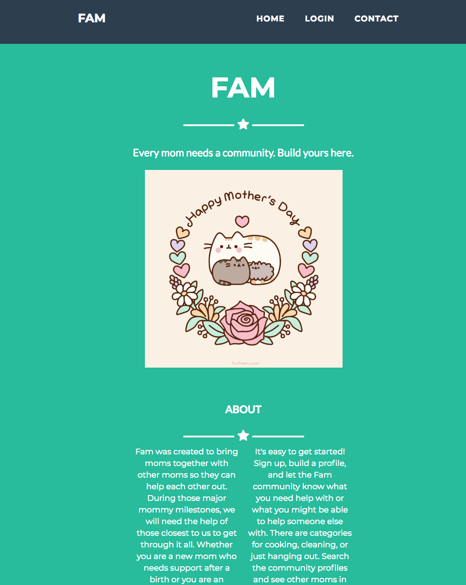
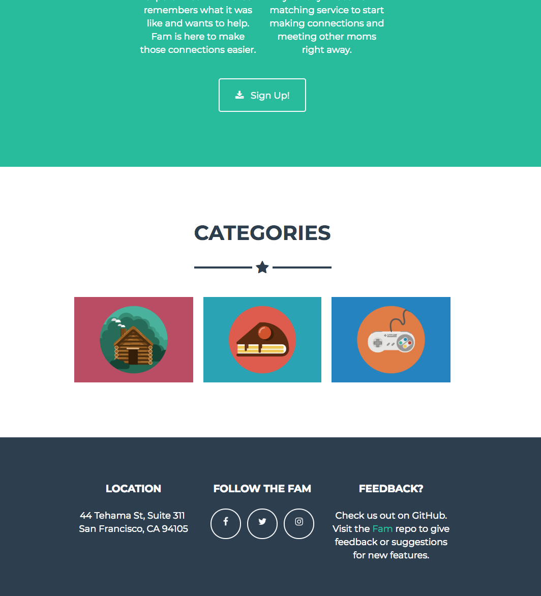

# Fam
A community-building web app built by Galvanize WDI students for their Q2 project.

## Description

Every parent needs a community. Build yours using Fam!

Every mom needs a community. Users can build their own community using the Fam Web App. Users can connect with other parents in their area, lend a helping hand to a new mom in need of a little house cleaning or a meal. Or users can ask for help from local parents to tidy up your their home or just chat; it can be pretty isolating being a stay at home parent!

## Getting Started

These instructions will get you a copy of the project up and running on your local machine for development and testing purposes. See deployment for notes on how to deploy the project on a live system.


### Prerequisites

```bash
brew install postgresql
brew install node
brew install heroku
```

### Installing

```bash
git clone https://github.com/Brechy/fam
npm i
createdb fam_dev
knex migrate:latest
knex seed:run
heroku local
open http://localhost:5000
```






## Deployment

Add additional notes about how to deploy this on a live system

## Built With

* [Bootstrap](https://startbootstrap.com/template-overviews/freelancer/) - The frontend framework used.
* [npm](https://www.npmjs.com/) - Dependency Management
* [Knex](https://knexjs.org/) - Used to generate database and backend structure.

## Authors

* **Brechin Andariese** - [Brechy](https://github.com/Brechy)
* **Nik SSeif** - [NikSS](https://github.com/niksseif)
* **J Ballin** - [JBallin](https://github.com/JBallin)

[Contributors](https://github.com/Brechy/q2_g88/graphs/contributors) the following people participated in this project.

## License

This project is licensed under the MIT License - see the [LICENSE.md](LICENSE.md) file for details

## Acknowledgments

* [PurpleBooth](https://gist.github.com/PurpleBooth/109311bb0361f32d87a2) - readme template.
* [James Andariese](https://github.com/jamesandariese) - consultant
* Inspired by humankind's nature to be nurtured by one another. Everyone needs a community.
